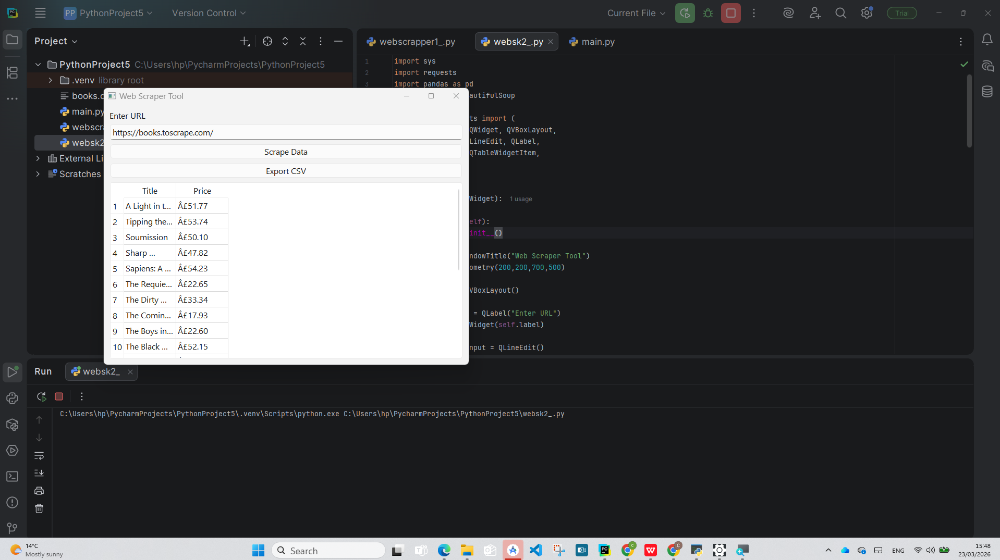

# WebScrap2
# WebScrap2

Python GUI Web Scraper built with PyQt6.

This application scrapes book data from https://books.toscrape.com/

Features
- GUI interface
- Extracts book titles and prices
- Displays data in a table
- Export to CSV

Tech Stack
- Python
- PyQt6
- BeautifulSoup
- Requests
- Pandas

